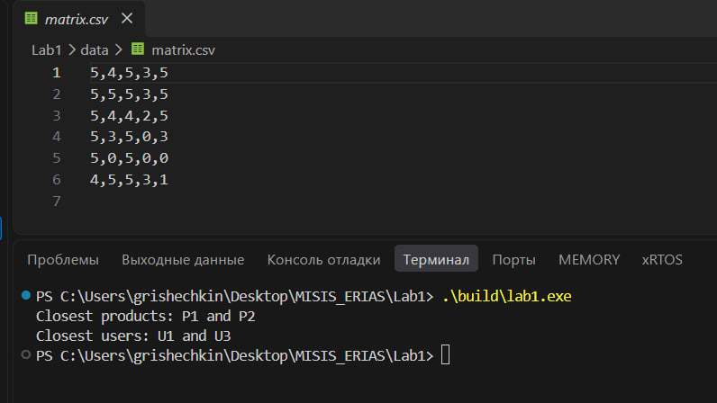
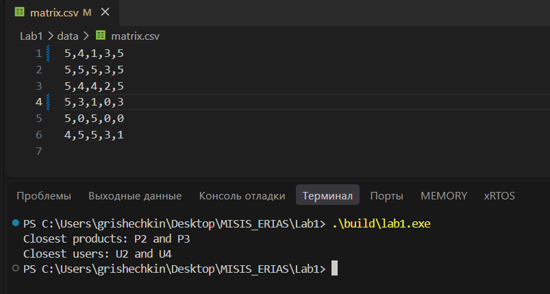

# Вывод при стандартных данных:
```
Closest products: P1 and P2
Closest users: U1 and U3
```
# Сборка:
```shell 
g++ -std=c++17 src/main.cpp src/solution.cpp -Iinclude -o build/lab1
```
# Запуск:
```shell 
.\build\app.exe
```

Для изменения исходной матрицы редактировать csv в папке data

# Скриншоты работы программы
## При матрице из примера

## При отредактированной матрице
